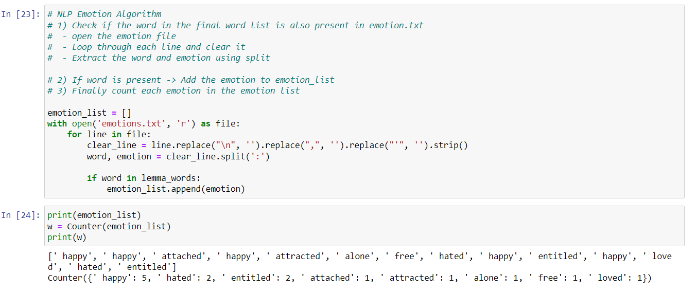
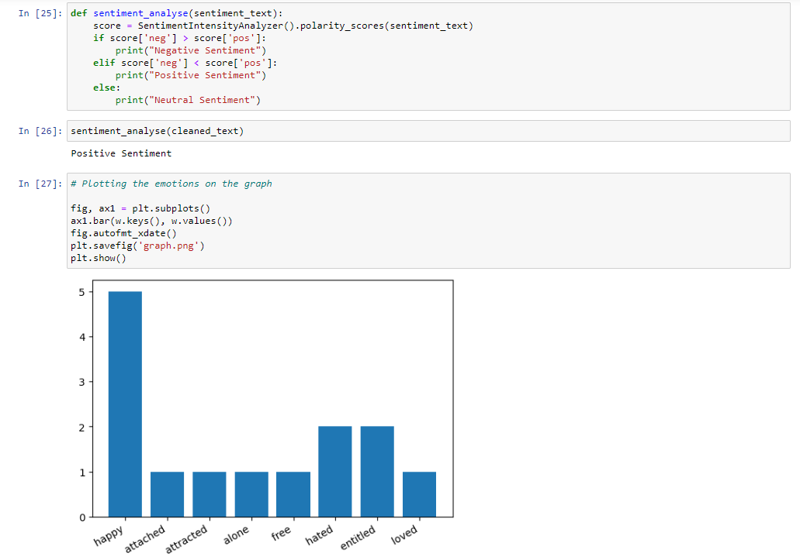

# Sentiment Analysis with Natural Language Processing

This project aims to analyze the emotions in the text written in a text file, create a column chart about these emotion intensities, and generally find out which sentiment polarity the text has.

## Features
- For this purpose, emotions.txt has been prepared, which contains the general meaning of which words correspond to which emotions in some words in a text.
- The text is located in read.txt. You can replace the content of this file with any text you want.
- The data in the text file must be cleared of stop words and punctiations and subjected to tokenization processes in order to perform correct analysis. Python's NLTK library was used for this.
- NLP algorithm was applied on the data prepared for analysis. This algorithm is as follows:
- NLP Emotion Algorithm:
- 1) Check if the word in the final word list is also present in emotion.txt
        - open the emotion file
       - Loop through each line and clear it
       - Extract the word and emotion using split
- 2) If word is present -> Add the emotion to emotion_list
- 3) Finally count each emotion in the emotion list
- Thanks to the polarity calculation feature offered by the NLTK library on the dataset, it was analyzed whether the text was generally positive, negative or neutral.
- After the algorithm was applied and the analyzes were performed, the analysis was visualized with the matplot library.

## Tech
- [Jupyter Notebook](https://jupyter.org) 
- [Python](https://www.python.org) 
- [Anaconda](https://www.anaconda.com) 

## Screenshot

